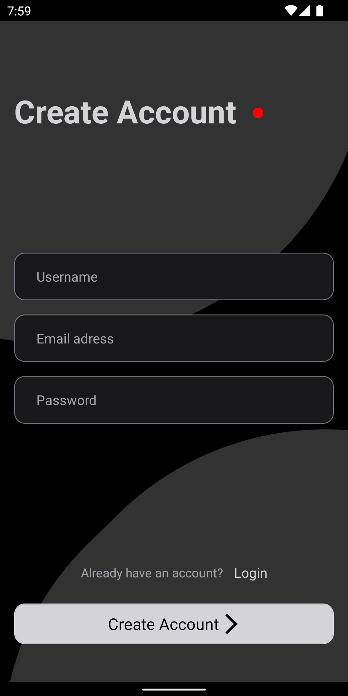
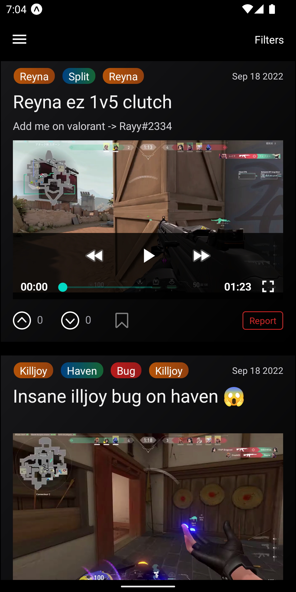
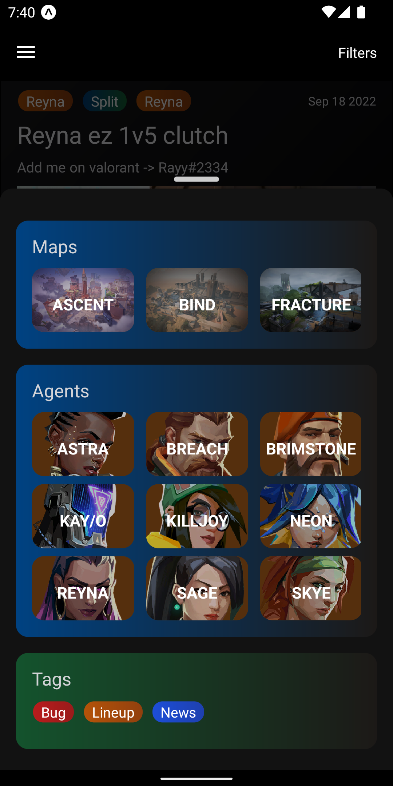
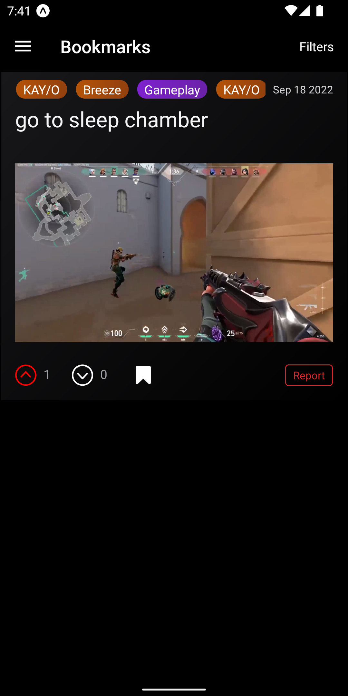

# Valorant News

Valorant News is a React Native application, designed to create a community where users can share and explore Valorant in-game videos and images.

## Features

- User Registration and Custom Authentication
- Posting and Viewing of Valorant in-game content
- Bookmars and Likes

## Screenshots






## Installation and Setup

To get Valorant News up and running on your local machine, follow these steps:

1. Clone the repository onto your local machine. Use the following command:

   ```bash
   git clone git@github.com:ybaha/valorant-news-app.git
   ```

2. Navigate to the app directory to install the necessary dependencies for the front-end:

   ```bash
   cd app/
   expo install
   ```

3. Navigate to the server directory to install the necessary dependencies for the back-end:

   ```bash
   cd ../server/
   npm install
   npx prisma db push
   ```
